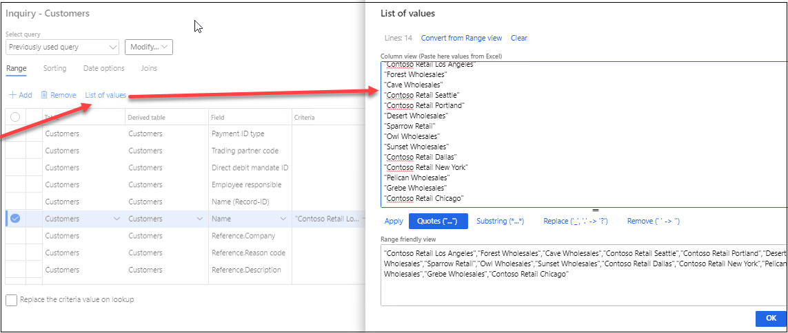
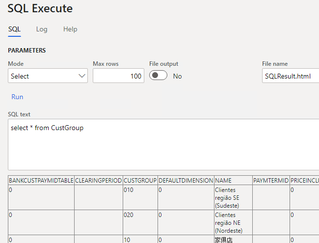

# XppTools

Useful X++ code samples

This repository contains 3 D365FO models:

- [XppTools](#xpptools)
  - [DEVTools model](#devtools-model)
    - [-Fields list](#-fields-list)
    - [-Display system field name in the query filter](#-display-system-field-name-in-the-query-filter)
    - [-Display table relation fields](#-display-table-relation-fields)
    - [-Editable table browser](#-editable-table-browser)
    - [-List of Values to Range](#-list-of-values-to-range)
    - [-Execute direct SQL in D365FO database](#-execute-direct-sql-in-d365fo-database)
    - [-D365FO Infolog call stack](#-d365fo-infolog-call-stack)
  - [DEVCommon model](#devcommon-model)
    - [-DEV class](#-dev-class)
    - [-DEVDimensionHelper class](#-devdimensionhelper-class)
    - [-Read Excel and CSV files](#-read-excel-and-csv-files)
  - [DEVTutorial model](#devtutorial-model)
    - [-Blocking in D365FO](#-blocking-in-d365fo)
    - [-Create ledger journals using X++](#-create-ledger-journals-using-x)
    - [-Create ledger journal from Excel file](#-create-ledger-journal-from-excel-file)
    - [-Parallel batch processing in X++](#-parallel-batch-processing-in-x)
  - [DEVTutorialReports submodel](#devtutorialreports-submodel)
    - [-Sales Invoice report](#-sales-invoice-report)
  - [DEVExternalIntegration submodel](#devexternalintegration-submodel)
    - [-File-based integration in Dynamics 365 FinOps using X++](#-file-based-integration-in-dynamics-365-finops-using-x)
    - [-Multicompany DMF integration in Dynamics 365 FinOps using X++](#-multicompany-dmf-integration-in-dynamics-365-finops-using-x)
    - [-XppInteg - Azure Service Bus integration solution for Dynamics 365 FinOps](#-xppinteg---azure-service-bus-integration-solution-for-dynamics-365-finops)
  - [Installation](#installation)
  - [Contribution](#contribution)

The DEV prefix is used for all objects.

## DEVTools model

It contains user X++ tools, with the additional application functionality. Each tool is located in the separate sub-model.

### -Fields list

Fields list form is an extended version of the standard Show all fields form with the additional features such as displaying all fields with the extended information, comparing and editing

Full description: [Fields list form](https://denistrunin.com/xpptools-fieldslist/). Sub-model name: DEVRecordInfo

### -Display system field name in the query filter

This utility adds system field name in the standard query filter lookup and in the "Personalize-Add columns" dialog. So you can search the field by Label(as standard) or by AOT name

Full description: [Filter by AOT name](https://denistrunin.com/xpptools-queryfieldsAOTname/). Sub-model name: DEVQueryFieldsAOTName

### -Display table relation fields

This utility adds additional relation information into **Add table join** function of the standard Advanced query form(Advanced filter or sort - Joins - Add table join)

Code is based on **sukhanchik** post on [axForum](https://translate.google.com/translate?hl=en&sl=ru&tl=en&u=http%3A%2F%2Faxforum.info%2Fforums%2Fshowthread.php%3Fp%3D417433%23post417433&sandbox=1)

Sub-model name: DEVSysQueryFormAddRelInfo

### -Editable table browser

Extension for the standard D365FO table browser that allows root navigation and editing for non-development environments.

Test link https://usnconeboxax1aos.cloud.onebox.dynamics.com/?cmp=USMF&mi=DEVSysTableBrowser&tablename=custgroup. A user should be in the group "DEV Editable table browser"

Full description: [Editable table browser](https://denistrunin.com/xpptools-devtablebrowser/). Sub-model name: DEVSysTableBrowser

### -List of Values to Range

This functionality is intended to help users deal with list of values in query range. With help of this tool you can:

- Copy list of values from, for example, excel and paste it in a range;
- Easily manage values of existed range

Full description: [List of Values to Range](https://denistrunin.com/xpptools-listvaluestorange/)
Sub-model name: DEVListOfValuesToRange

**[⬆ back to top](#XppTools)**

### -Execute direct SQL in D365FO database

'Execute direct SQL' is a simple form that allows to write and execute direct SQL from the browser on D365FO database.

Full description: [Execute direct SQL in D365FO database](https://denistrunin.com/xpptools-sqlexecute/)
Sub-model name: DEVSQLExecute

### -D365FO Infolog call stack

Extension for the standard D365FO system that allows saving stack trace data for infolog messages.

Full description: [D365FO Infolog call stack](https://denistrunin.com/xpptools-devinfocallstack/)
Sub-model name: DEVCallStackInfolog

**[⬆ back to top](#XppTools)**

## DEVCommon model

Elements that can be shared between different projects

### -[DEV](https://github.com/TrudAX/XppTools/blob/master/DEVCommon/DEVCommon/AxClass/DEV.xml) class

Collection of [global methods](https://denistrunin.com/xpptools-devglobal/)

### -DEVDimensionHelper class

[DEVDimensionHelper](https://github.com/TrudAX/XppTools/blob/master/DEVCommon/DEVCommon/AxClass/DEVDimensionHelper.xml) class contains various methods to work with the financial dimensions.

Description: Working with the [Financial dimensions](https://denistrunin.com/xpptools-devfindim/)

### -Read Excel and CSV files

Classes: [**DEVFileReaderBase**](https://github.com/TrudAX/XppTools/blob/master/DEVCommon/DEVCommon/AxClass/DEVFileReaderBase.xml),  [**DEVFileReaderCSV**](https://github.com/TrudAX/XppTools/blob/master/DEVCommon/DEVCommon/AxClass/DEVFileReaderCSV.xml) and  [**DEVFileReaderExcel**](https://github.com/TrudAX/XppTools/blob/master/DEVCommon/DEVCommon/AxClass/DEVFileReaderExcel.xml)  - read from CSV and XLSX files

Description: [How to read Excel and CSV files in D365FO using X++](https://denistrunin.com/xpptools-readexcelfile/)

**[⬆ back to top](#XppTools)**

## DEVTutorial model

Various X++ examples, that can be used to test something or used as a template. Elements can reference to DEVCommon model objects

### -Blocking in D365FO

Form **DEVBlockingTest**, table **DEVBlockingTestTable**(to test SQL blocking issues)

[Blocking in D365FO](https://denistrunin.com/understanding-sql-blocking/)

### -Create ledger journals using X++

Class **[DEVTutorialCreateLedgerJournal](https://github.com/TrudAX/XppTools/blob/master/DEVTutorial/DEVTutorial/AxClass/DEVTutorialCreateLedgerJournal.xml)** that demonstrates different methods for a ledger journal creation

[Create ledger journals in D365FO using X++](https://denistrunin.com/xpptools-createledgerjournal/)

### -Create ledger journal from Excel file

Class [**DEVReadFromFileExampleCreateJournal**](https://github.com/TrudAX/XppTools/blob/master/DEVTutorial/DEVTutorial/AxClass/DEVReadFromFileExampleCreateJournal.xml)  - sample code to create a ledger journal from Excel file

### -Parallel batch processing in X++

Classes [DEVTutorialBatchSingleThread](https://github.com/TrudAX/XppTools/blob/master/DEVTutorial/DEVTutorial/AxClass/DEVTutorialBatchSingleThread.xml), [DEVTutorialBatchMultipleThreadBase](https://github.com/TrudAX/XppTools/blob/master/DEVTutorial/DEVTutorial/AxClass/DEVTutorialBatchMultipleThreadBase.xml),  [DEVTutorialBatchMultipleThread](https://github.com/TrudAX/XppTools/blob/master/DEVTutorial/DEVTutorial/AxClass/DEVTutorialBatchMultipleThread.xml) that demonstrates how you can convert your existing batch job to multi-threaded.

[A simple way to implement a parallel batch processing in X++](https://denistrunin.com/xpptutorial-batchmultithread/)

## DEVTutorialReports submodel

Contains report development examples

### -Sales Invoice report

A sample code to Create a new design for Sales Invoice report in D365FO (https://denistrunin.com/xpptools-reportsalesinvoice/)

## DEVExternalIntegration submodel

Contains integration solution XppInteg. It consists from [core module](https://github.com/TrudAX/XppTools/tree/master/DEVTutorial/DEVExternalIntegration) and [samples](https://github.com/TrudAX/XppTools/tree/master/DEVTutorial/DEVExternalIntegrationSamples)

### -File-based integration in Dynamics 365 FinOps using X++

A sample code for implementing file-based integration in Dynamics 365 FinOps using X++. Create Ledger journals based on periodic import of Excel/CSV files from Azure storage   (https://denistrunin.com/xpptools-fileintegledger/). Test files for Demo database [here](https://github.com/TrudAX/XppTools/blob/master/assets/TestPeriodicLedgerJournalImport.zip)

### -Multicompany DMF integration in Dynamics 365 FinOps using X++

A sample code to implement recurring file-based integration in D365FO using X++ and DMF (https://denistrunin.com/xpptools-fileintegdmf/).

### -XppInteg - Azure Service Bus integration solution for Dynamics 365 FinOps

A sample code to implement Azure Service Bus integration in D365FO using X++ (https://denistrunin.com/xpptools-integservbussalesjson/).

**[⬆ back to top](#XppTools)**

## Installation

1. Download the Source code from this GitHub repo into the Temp directory on the DEV VM.
2. Copy **DEVTools**(or DEVGlobal, DEVTutorial) folder to your package folder (C:\AOSService\PackagesLocalDirectory )
3. Start Visual Studio and Run compile for the **DEVTools** folder (Dynamics 365 –Build models.. – Select DEVTools)
4. Run database sync - **Invoke-D365DbSyncModule -Module "DEVTools"**

If you want to contribute - change the objects using Visual Studio in the **DEVTools** model, copy the changed elements(xml files) back into the Temp folder and create GitHub pull request from this Temp folder.

If you want to rename elements prefix you can use this tool that can change multiple file names - **Bulk Rename Utility**. (From DEV to YourPrefix). Then run **Replace in files** in Notepad++ .

## Contribution

Feel free to create issues and PRs 😃
